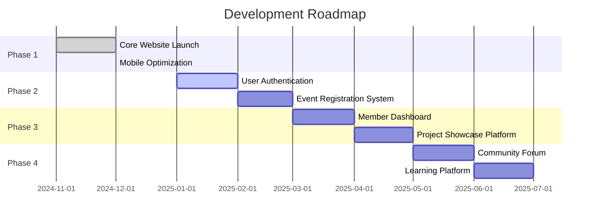

# 🇬🇭 Expo Ghana Community Website

<div align="center">
  
  
  <p align="center">
    <strong>The official Expo Ghana community website</strong>
  </p>
  
  <p align="center">
    A sleek, minimal, and blazing-fast community platform built with Next.js and MagicUI components
  </p>

  <p align="center">
    <a href="#features">Features</a> •
    <a href="#tech-stack">Tech Stack</a> •
    <a href="#getting-started">Getting Started</a> •
    <a href="#project-structure">Structure</a> •
    <a href="#contributing">Contributing</a>
  </p>
</div>

---

## 📖 About

Expo Ghana connects developers, designers, and founders with resources, mentorship, and collaborations to launch world-class mobile experiences faster. This website serves as the central hub for our community activities, events, resources, and open-source projects.

### 🎯 Mission

To build and nurture a thriving community of Expo developers across Ghana, providing access to:
- **Resources**: Starter kits, documentation, guides, and video tutorials
- **Events**: Meetups, hack nights, and hybrid conferences
- **Open Source**: Community-maintained projects and contributions
- **Mentorship**: Connect with experienced developers
- **Opportunities**: Career growth and collaboration

---

## ✨ Features

### Core Features

| Feature | Description | Status |
|---------|-------------|--------|
| **Hero Section** | Dynamic hero with CTAs and partner marquee | ✅ Complete |
| **Spotlight Search** | Command+K search with text highlighting | ✅ Complete |
| **Dock Navigation** | Floating bottom navigation with smooth scrolling | ✅ Complete |
| **Resources Hub** | Interactive terminal, BentoGrid cards, and guides | ✅ Complete |
| **Gallery** | Lightbox modal with keyboard navigation & filters | ✅ Complete |
| **Blog Section** | Article cards with subscription modal | ✅ Complete |
| **Contact Drawer** | Slide-in contact form with validation | ✅ Complete |
| **Theme Toggle** | Light/Dark mode with smooth transitions | ✅ Complete |

### Special Features

- **🔍 Smart Search**: Type to search sections or find text within content with auto-highlight
- **⚡ Blazing Fast**: Optimized performance with Next.js 16 and React 19
- **📱 Mobile First**: Fully responsive design with touch-optimized interactions
- **♿ Accessible**: WCAG compliant with keyboard navigation and screen reader support
- **🎨 Beautiful UI**: Smooth animations powered by Framer Motion
- **🌓 Dark Mode**: Elegant theme switching with system preference detection

---

## 🛠️ Tech Stack

### Framework & Core


| Technology | Version | Purpose |
|------------|---------|---------|
| **Next.js** | 15.x | React framework with App Router |
| **React** | 19.x | UI library |
| **TypeScript** | 5.x | Type safety |
| **Tailwind CSS** | 3.x | Utility-first styling |
| **Framer Motion** | Latest | Animation library |

### UI Components & Libraries

- **MagicUI**: Advanced UI components (BentoGrid, Marquee, AnimatedList, Terminal, Dock)
- **Lucide React**: Modern icon library
- **Sonner**: Toast notifications
- **Canvas Confetti**: Celebration effects

### Development Tools

- **ESLint**: Code linting
- **PostCSS**: CSS processing
- **pnpm/npm**: Package management

---

## 🚀 Getting Started

### Prerequisites

- Node.js 18.x or higher
- npm, yarn, pnpm, or bun
- Git

### Installation

1. **Clone the repository**

```bash
git clone https://github.com/expo-ghana/website.git
cd website
```

2. **Install dependencies**

```bash
npm install
# or
pnpm install
# or
yarn install
```

3. **Run the development server**

```bash
npm run dev
# or
pnpm dev
# or
yarn dev
```

4. **Open in browser**

Navigate to [http://localhost:3000](http://localhost:3000)

### Build for Production

```bash
npm run build
npm start
```

### Linting

```bash
npm run lint
```

---

## 📁 Project Structure

```
expo-gh/
├── public/
│   ├── header/
│   │   └── logo.png              # Site logo
│   └── gallery/                  # Gallery images
│       ├── event-1.jpg
│       └── ...
├── src/
│   ├── app/
│   │   ├── layout.tsx            # Root layout with providers
│   │   ├── page.tsx              # Home page
│   │   └── globals.css           # Global styles
│   ├── components/
│   │   ├── layout/
│   │   │   ├── site-header.tsx   # Fixed header with logo & search
│   │   │   ├── footer.tsx        # Site footer with links
│   │   │   ├── contact-drawer.tsx # Contact form drawer
│   │   │   └── pointer-smooth-cursor.tsx # Custom cursor
│   │   ├── navigation/
│   │   │   └── dock-navigation.tsx # Floating bottom dock
│   │   ├── sections/
│   │   │   └── home/
│   │   │       ├── home-hero.tsx      # Hero section
│   │   │       ├── about.tsx          # About section
│   │   │       ├── community-highlights.tsx
│   │   │       ├── upcoming-events.tsx
│   │   │       ├── open-source.tsx    # Projects showcase
│   │   │       ├── gallery.tsx        # Image gallery
│   │   │       ├── resources.tsx      # Resources hub
│   │   │       └── blog.tsx           # Blog section
│   │   └── ui/
│   │       ├── spotlight-search.tsx   # Search modal
│   │       ├── drawer.tsx             # Reusable drawer
│   │       ├── dock.tsx               # Dock component
│   │       ├── bento-grid.tsx         # Card grid layout
│   │       ├── marquee.tsx            # Scrolling text
│   │       ├── terminal.tsx           # Code terminal
│   │       ├── animated-list.tsx      # List animations
│   │       ├── animated-theme-toggler.tsx
│   │       └── button.tsx             # Button component
│   ├── config/
│   │   └── site.ts               # Site configuration
│   ├── lib/
│   │   └── utils.ts              # Utility functions
│   └── types/
├── .eslintrc.json
├── tailwind.config.ts
├── tsconfig.json
├── next.config.ts
├── package.json
└── README.md
```

### Component Architecture


### Data Flow


---

## 🎨 Design System

### Color Palette

Our design uses CSS variables for theming:

| Variable | Light Mode | Dark Mode |
|----------|------------|-----------|
| `--background` | hsl(0 0% 100%) | hsl(222.2 84% 4.9%) |
| `--foreground` | hsl(222.2 84% 4.9%) | hsl(210 40% 98%) |
| `--primary` | hsl(221.2 83.2% 53.3%) | hsl(217.2 91.2% 59.8%) |
| `--muted` | hsl(210 40% 96.1%) | hsl(217.2 32.6% 17.5%) |
| `--border` | hsl(214.3 31.8% 91.4%) | hsl(217.2 32.6% 17.5%) |

### Typography

- **Sans Font**: Geist Sans (Variable font)
- **Mono Font**: Geist Mono (Variable font)

### Spacing Scale

```
Mobile: Compact spacing with 0.75x - 0.85x scale
Tablet: Standard spacing with 1x scale  
Desktop: Generous spacing with 1.2x scale
```

---

## 🔧 Configuration

### Site Configuration

Edit `src/config/site.ts`:

```typescript
export const siteConfig = {
  name: "Expo Ghana",
  description: "Official Expo Ghana community",
  url: "https://expoghana.community",
  cta: {
    primary: {
      title: "Join us now",
      href: "#join"
    }
  }
}
```

### Environment Variables

Create a `.env.local` file:

```env
NEXT_PUBLIC_SITE_URL=http://localhost:3000
```

---

## 🤝 Contributing

We welcome contributions from the community! Here's how you can help:

### Contribution Guidelines

1. **Fork the repository**
2. **Create a feature branch**
   ```bash
   git checkout -b feature/amazing-feature
   ```
3. **Commit your changes**
   ```bash
   git commit -m 'Add some amazing feature'
   ```
4. **Push to the branch**
   ```bash
   git push origin feature/amazing-feature
   ```
5. **Open a Pull Request**

### Code Standards

- ✅ **TypeScript**: Use strict type checking
- ✅ **Components**: Follow component composition patterns
- ✅ **Styling**: Use Tailwind utility classes
- ✅ **Naming**: Use descriptive, camelCase for variables, PascalCase for components
- ✅ **Commits**: Write clear, concise commit messages
- ✅ **Accessibility**: Ensure ARIA labels and keyboard navigation

### Pull Request Checklist

- [ ] Code follows project style guidelines
- [ ] Self-review of code completed
- [ ] Comments added for complex logic
- [ ] No console errors or warnings
- [ ] Responsive design tested on mobile
- [ ] Dark mode works correctly
- [ ] Accessibility requirements met

### Areas for Contribution

| Area | Difficulty | Description |
|------|-----------|-------------|
| **Bug Fixes** | 🟢 Easy | Fix reported issues |
| **UI Components** | 🟡 Medium | Create new reusable components |
| **Performance** | 🔴 Hard | Optimize bundle size & loading |
| **Documentation** | 🟢 Easy | Improve code comments & docs |
| **Testing** | 🟡 Medium | Add unit/integration tests |
| **Features** | 🔴 Hard | Implement new sections |

---

## 🐛 Bug Reports

Found a bug? Please open an issue with:

1. **Description**: Clear description of the issue
2. **Steps to Reproduce**: How to reproduce the bug
3. **Expected Behavior**: What should happen
4. **Actual Behavior**: What actually happens
5. **Screenshots**: If applicable
6. **Environment**: Browser, OS, screen size

---

## 📄 License

This project is licensed under the MIT License - see the [LICENSE](LICENSE) file for details.

---

## 🙏 Acknowledgments

- **MagicUI** - For amazing UI components
- **Framer Motion** - For smooth animations
- **Vercel** - For hosting and deployment
- **Expo Team** - For the incredible Expo framework
- **Contributors** - Thank you to all who contribute!

---

## 📞 Contact

- **Website**: [expoghana.community](https://expoghana.community)
- **Twitter**: [@expoghana](https://twitter.com/expoghana)
- **GitHub**: [github.com/expo-gh](https://github.com/expo-gh)
- **Email**: hello@expoghana.community

---

## 🗺️ Roadmap



### Upcoming Features

- [ ] **Member Authentication** - Sign up and login system
- [ ] **Event RSVP** - Register for meetups and events
- [ ] **Project Submissions** - Submit open-source projects
- [ ] **Resource Voting** - Community curated resources
- [ ] **Newsletter Integration** - Automated email campaigns
- [ ] **Job Board** - Community job postings
- [ ] **Mentorship Matching** - Connect mentors with mentees

---

<div align="center">
  <p>Made with ❤️ by the Expo Ghana Community</p>
  <p>
    <a href="https://github.com/expo-gh/website/stargazers">⭐ Star us on GitHub</a>
  </p>
</div>
